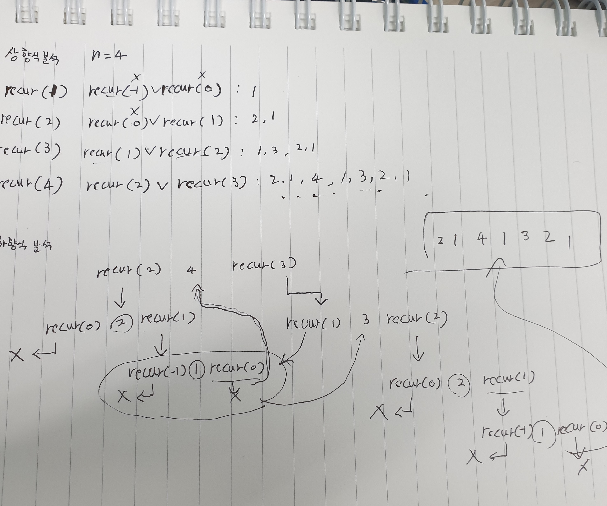

```java
static void recur(int n) {
    if (n > 0) {
        recur(n-2);
        System.out.println(n);
        recur(n-1);
    }
}
```

## 상향식 분석
아래쪽부터 쌓아올리며 분석하는 기법
  메서드 |          과정         | 출력 
recur(1) : recur(-1) 1 recur(0) -> 1
recur(2) : recur(0) 2 recur(1)  -> 2 1
recur(3) : recur(1) 3 recur(2)  -> 1 3 2 1 
recur(4) : recur(2) 4 recur(3)  -> 2 1 4 1 3 2 1 

결론 n = 4일 때 2 1 4 1 3 2 1 출력

## 하향식 분석
위쪽부터 분석하는 기법
사진으로 대체

     


// 반복문으로 수정
```java
    public static void recur(int n) {
      Stack<Integer> s = new Stack<>();

      while (true) {
        if (n > 0) {
          s.push(n);
          n = n-2;
          continue;
        }

        if (!s.isEmpty()) {
          n = s.pop();
          System.out.println(n);
          n = n-1;
          continue;
        }
        break;
      }
    }
```
